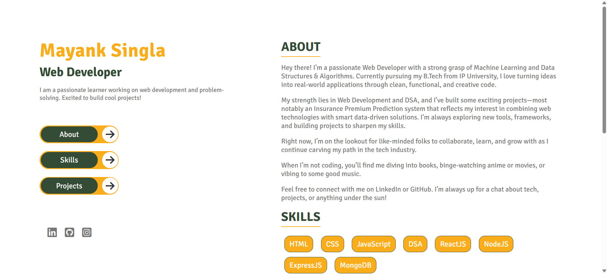
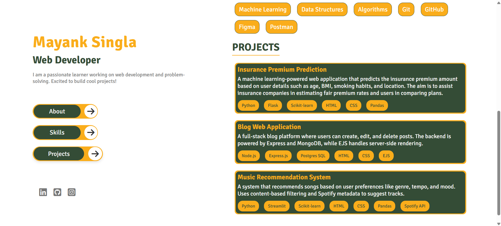

# 💼 Personal Portfolio - Mayank Singla

Welcome to my personal portfolio website! This is a sleek, single-page responsive portfolio built using HTML, CSS, and JavaScript. It showcases my skills, projects, and social links — all in a modern, minimal design.

[🔗 Live Demo](https://mayanksingla910.github.io/Portfolio/) <!-- Replace with your GitHub Pages link -->

---

## ✨ Features

- 🧠 Intro/About section with my background and interests
- 🧰 Skills section listing my tech stack
- 💼 Projects section with descriptions and tech used
- 🧭 Navigation with smooth scrolling and active highlighting
- 🏠 Clickable name that scrolls to top
- ⚡ Clean UI and responsive design across devices
- 🖱️ Subtle animations on project cards using AOS.js

---

## 🛠️ Built With

- **HTML5**
- **CSS3**
- **JavaScript (vanilla)**
- [Font Awesome](https://fontawesome.com/) - Icons

---

## 📂 Folder Structure

```plaintext
/
├── index.html         # Main HTML file
├── style.css          # Custom styling
├── script.js          # Smooth scroll & active nav
└── README.md
```

---

## 🖼️ Screenshots

### 💻 Desktop View



---

## 🚀 How to Use

To view or customize the portfolio:

1. **Clone the repository**
   ```bash
   git clone https://github.com/mayanksingla910/portfolio.git
   ```

2. **Open the project**
   ```bash
   cd portfolio
   ```

3. **Run locally**
   Just open `index.html` in your browser.

---

## 🧠 What I Learned

- Structuring clean, semantic HTML and reusable CSS  
- Creating responsive layouts with Flexbox  
- Adding smooth scroll and scroll-based active states  
- Using AOS for element animation  
- Enhancing UX with subtle transitions and clickable elements

---

## 🎯 Future Improvements

- Add a contact form with backend integration  
- Deploy with a custom domain  
- Add dark/light mode toggle  
- Make sections more dynamic using a frontend framework (React)

---

## 🙌 Acknowledgements

- [AOS](https://github.com/michalsnik/aos) – Animate On Scroll Library  
- [Font Awesome](https://fontawesome.com/) – Icon Library  
- Inspiration from modern dev portfolios

---

## 🧑‍💻 Author

**Mayank Singla**  
- [LinkedIn](https://www.linkedin.com/in/singla-mayank/)  
- [GitHub](https://github.com/mayanksingla910)  
- Email: singlamayank10@gmail.com

---

## 📄 License

This project is open-source and available under the [MIT License](LICENSE).

_Thanks for checking out my portfolio! Feel free to fork, use, or suggest improvements._ ✨
